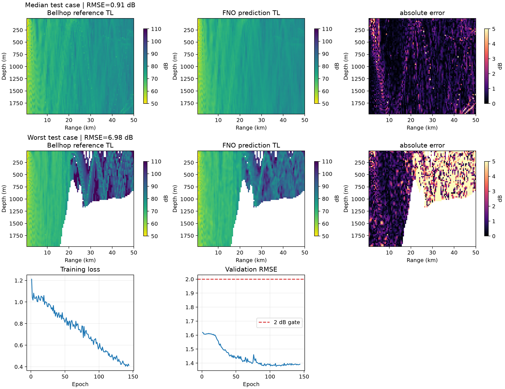

# 巴士海峡真实环境数据复用快速验证 v0.1

## 结论先行

本轮没有运行 Bellhop，也没有新增标签，而是直接复用 `ocean-field-project` 已冻结的巴士海峡
环境与声场数据，验证真实地形、真实月度 SSP 条件下的 TL 代理难度。

在固定 500 Hz、50 m 声源、50 km 距离和约 2000 m 接收深度的 60 场小数据集上，推荐的
terrain-anchor FNO 在冻结测试月份达到：

- TL RMSE：2.314 dB；
- TL MAE：0.947 dB；
- GPU batch=1 P95：4.22 ms；
- CPU batch=1 P95：37.22 ms。

因此，若“平均误差”按 MAE 解释，则误差和时延均已满足 2 dB / 100 ms；若继续沿用本项目更
保守的 RMSE 门槛，则尚差 0.314 dB，不能声明通过。该结果只能作为真实环境可行性 proxy，
不能替代 1 kHz、25,600 射线正式验收。



## 1. 数据来源与复用范围

环境数据来自兄弟项目 `ocean-field-project` 的 `bashi_phase1_v0.1`：

- 候选中心：20.5°N、121.5°E；候选框为 120.349–122.651°E、19.422–21.578°N；
- 地形：GEBCO 2026 区域子集，沿 0°、72°、144°、216°、288° 五个方位提取距离相关剖面；
- SSP：WOA23 0.25° 月度温盐气候态，通过 TEOS-10/GSW 转换声速；月度数据到 1500 m，
  更深处由年度气候态补齐；
- 标签：现成的 3,200 射线 Bellhop 非相干 TL；底质沿用兄弟项目的 `rock` 工程假设；
- 冻结源数据 SHA-256：
  `f84f2592eaff8ed4c90d7a620bb5f2e9aa5b30e88140ec5cd6b53cb89cf6361f`。

为了与当前项目硬场景尽量接近，并保持问题简单，本轮只选择现有标签中的最高频 500 Hz、
50 m 声源，并把 110 km × 2500 m 原始网格裁剪为 0.5–50 km、10–1975.8 m。最终为
60 场、76×100 网格：

| 划分 | 月份 | 场数 |
|---|---|---:|
| train | 1、3、4、6、7、9、10、12 月 | 40 |
| validation | 2、8 月 | 10 |
| test | 5、11 月 | 10 |

划分单位是完整声场，不按网格点随机拆分。测试月份没有参与均值场、残差尺度、训练或选模。

## 2. 输入、目标与方法

模型输入为五通道二维张量：

1. WOA23 SSP 在接收深度上的插值场，归一化为 `(c-1500)/50`；
2. GEBCO 距离相关海底深度，除以该方位最大水深；
3. 频率平面；
4. 声源深度平面；
5. 有效水体 mask。

目标直接使用 Bellhop 原始 `reference_tl_db`，没有先转成能力指数。推荐模型采用 24 个隐藏
通道、4 层 FNO、12×24 截断模态、depth/range 为 8/16 的非周期复制 padding 和残差 block，
参数量为 1,333,217。

真实地形在当前小数据集中只有五条固定剖面。为避免让小模型重复学习每条地形的静态主场，
我们只用训练月份为每个方位计算 terrain anchor：

```text
anchor_a(z,r) = mean{ TL_i(z,r) | i belongs to training months and azimuth a }
residual_i(z,r) = TL_i(z,r) - anchor_a(z,r)
```

FNO 学习由月度 SSP 驱动的标准化残差，推理时再加回对应方位的 anchor。该设计没有使用测试
月份；它有意服务于当前固定海区、固定五方位的小任务，不主张跨海区泛化。

## 3. Baseline 与迭代结果

| 方法 | 500 Hz 测试 RMSE | 测试 MAE | 说明 |
|---|---:|---:|---|
| 全局训练均值场 | 4.366 dB | 2.472 dB | 不使用环境输入 |
| 按方位训练均值场 | 2.092 dB | 0.851 dB | 强小域查表 baseline |
| 现有 400 射线 Bellhop | 3.436 dB | 1.931 dB | 对齐 3,200 射线参考 |
| 全局均值残差 FNO | 2.387 dB | 0.980 dB | 首轮改进型 FNO |
| **terrain-anchor FNO** | **2.314 dB** | **0.947 dB** | 当前推荐结果 |
| 三频共享 terrain-anchor FNO | 2.448 dB | 0.993 dB | 增至 180 场，未改善目标切片 |

三频共享实验复用了 250/375/500 Hz 共 180 场，但 500 Hz 目标切片反而退化。这与此前“小域
任务中数据覆盖增大不一定改善严格同分布指标”的观察一致，因此不继续盲目扩张数据或模型。

## 4. 分方位诊断

| 方位 | 测试 RMSE | 测试 MAE | 判断 |
|---:|---:|---:|---|
| 0° | 0.839 dB | 0.576 dB | 通过 |
| 72° | 5.557 dB | 2.955 dB | 主要瓶颈 |
| 144° | 1.441 dB | 0.965 dB | 通过 |
| 216° | 0.752 dB | 0.461 dB | 通过 |
| 288° | 0.716 dB | 0.461 dB | 通过 |

四条方位已经明显低于 2 dB。误差主要由 72° 剖面贡献，尤其是 5 月样本：该剖面约在
15–25 km 出现快速浅化，后方形成大面积阴影/弱覆盖区，局部误差和少量极端误差显著放大
RMSE。10 个测试场的中位逐场 RMSE 为 0.868 dB，但最差场为 6.981 dB。

兄弟项目已有射线审计也表明，该困难场的标签质量需要谨慎解释：在 5 月、72°、250 Hz 的
代表场上，1,600 射线相对 3,200 射线仍有 6.97 dB RMSE。因此 3,200 射线只能称为当前 POC
参考，不能称为满足本项目高质量要求的收敛真值。继续针对这一标签调大模型，可能是在拟合
射线离散误差，而不是真实传播规律。

## 5. 时延

terrain-anchor FNO 的 batch=1 完整张量输入、模型前向、反归一化和 CPU 回传计时为：

| 设备 | Median | P95 | 100 ms 门槛 |
|---|---:|---:|---|
| NVIDIA A100 | 3.76 ms | 4.22 ms | 通过 |
| 当前 6 线程 CPU | 28.26 ms | 37.22 ms | 通过 |

terrain anchor 是一次数组选择与加法，不改变时延结论。

## 6. 当前判断与最小下一步

本轮已经确认：真实 GEBCO 地形和 WOA23 SSP 并不会普遍破坏代理精度；四条方位可直接达到
2 dB，整体 MAE 和 CPU/GPU 时延也均通过。当前 RMSE 未通过集中在单条复杂坡地形，而且现成
3,200 射线参考本身没有完成高射线数收敛审计。

因此下一步不建议继续增加低质量标签或扩大网络。若后续允许少量 Bellhop 计算，最小且信息
量最高的动作是：先对 72° 与一个平缓方位、5/11 月、1 kHz 做少量 3,200/6,400/12,800/
25,600 射线阶梯审计；只有确认 25,600 射线标签稳定后，再决定是否生成 12 月×5 方位共
60 场的正式 1 kHz 小数据集。本轮没有执行该步骤。

## 7. 复现

```bash
cd /home/ubuntu/project/ocean-acoustic-surrogate
uv sync --locked
uv run python scripts/validate_bashi_reuse.py \
  configs/field_validation/bashi_reuse_terrain_anchor_v0.2.yaml
```

代码提交：`61f9a06e7fe12cdb3ec0989bdf87f5ceaf1e86db`；兄弟项目提交：
`2c12d0ae4064059a462254b9731239f69fdcfcb8`。完整 checkpoint、预测与训练曲线位于：

```text
/mnt/data/xuangu-fang/ocean-acoustics/projects/ocean-acoustic-surrogate/field_validation/
20260827T140609Z_bashi_reuse_terrain_anchor_v0.2_f500_z50_r50_d2000/
```

Git 中保留轻量指标 `docs/results/bashi_reuse_quick_validation_v0.1.json` 和本报告所用诊断图。
