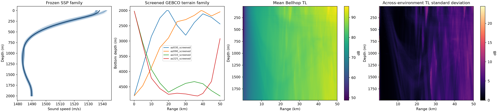
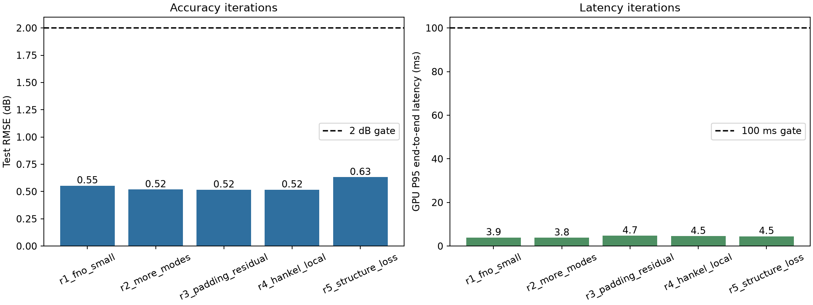
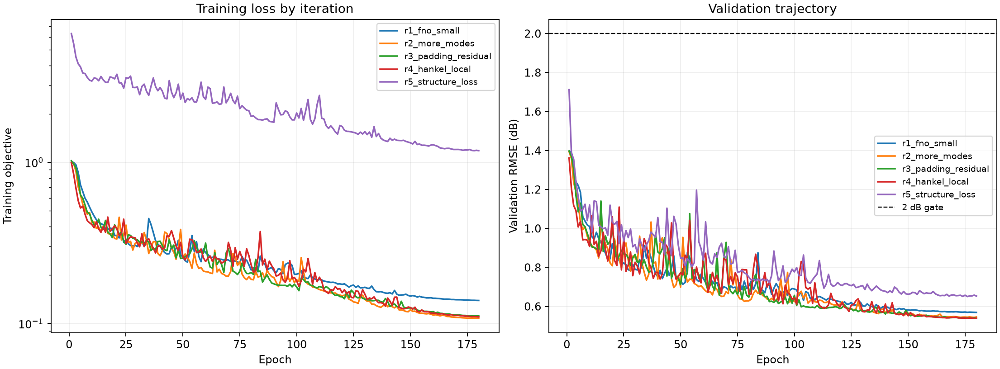
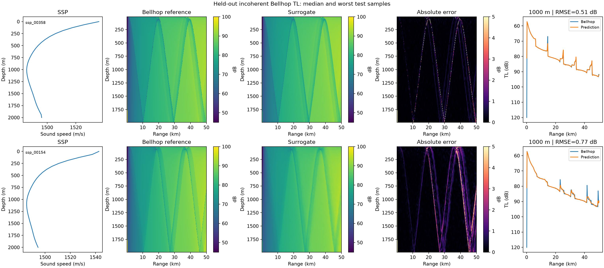

# 1 kHz 深海声传播损失快速代理项目报告

状态：MVP 已完成并通过验收

实验日期：2026-08-27

数据集：`scs_june_narrow_v0.1`
代码仓库：`xuangu-fang/ocean-acoustic-surrogate`（private）

## 1. 执行摘要

本阶段采用“先缩窄、先达标”的策略，没有尝试跨海区、跨源深、跨频率或跨底质泛化。
只在一个固定、可复现的南海 6 月型深海 SSP 小族上学习从一维声速剖面到完整二维
距离—深度非相干传播损失场的映射。正式数据由 Bellhop 以 25,600 rays 生成，并在生成前
完成独立的射线数收敛审计。

最终得到两个有明确用途的验收模型：

| 模型 | 用途 | 测试 RMSE | 测试 MAE | P95 完整推理 | 参数量 | 结论 |
|---|---|---:|---:|---:|---:|---|
| `r3_padding_residual` | A100 精度优胜 | 0.5165 dB | 0.1802 dB | 4.73 ms（GPU） | 6.30 M | 通过 |
| `r1_fno_small` | 便携 MVP | 0.5542 dB（CUDA） | 0.2163 dB | 3.91 ms（GPU）/ 40.06 ms（CPU） | 1.33 M | 通过 |

`r3` 在新进程中重新加载 checkpoint 后，重算 RMSE 为 0.516512 dB，与训练进程记录值
只差 0.0000049 dB；数据 SHA-256 一致，新进程 GPU P95 为 4.27 ms。`r1` 还在 CPU
上做了跨后端独立验收：RMSE 0.7582 dB、MAE 0.3067 dB、最差单样本 RMSE 1.0845 dB、
P95 38.32 ms，仍同时满足 2 dB 和 100 ms 门槛。因此，即使不把 GPU 作为隐含条件，
本阶段也已有一个严格达标的交付候选。

## 2. 验收域与不做的事情

### 2.1 冻结硬条件

- 频率：1000 Hz；
- 最大传播距离：50 km；
- 水深：2000 m；
- 声源深度：50 m；
- 环境：距离无关，但 SSP 随深度非均匀；
- 海底：流体沙质半空间，声速 1700 m/s、密度 2000 kg/m³、衰减 0.8 dB/λ；
- 数值参考：Bellhop 非相干 TL，单位 dB；
- 输出网格：深度 10–1990 m 共 96 点，距离 0.1–50 km 共 256 点；
- 误差门槛：密封测试集整体 RMSE 和 MAE 均不超过 2 dB；
- 速度门槛：batch=1 热态完整推理 P95 不超过 100 ms。

“完整推理”计时包括从 NumPy 特征创建 tensor、移动到目标设备、模型前向、训练均值场
反归一化、复制回 CPU NumPy，以及 GPU 同步；不包括首次加载模型和冷启动。

### 2.2 主动收窄的边界

本报告不声称模型能处理不同源深、不同频率、不同水深、不同底质、距离相关 SSP、任意
海区或甲方私有 Bellhop 的数值差异。甲方 Bellhop 到位后，应先用少量完全相同 case 做
数值对齐，再决定是否微调。当前成果的目的就是证明：在严格满足固定参数的一个简单
环境族上，准确率和速度可以有很大余量地达标。

## 3. 仓库、版本与数据治理

新项目位于 `/home/ubuntu/project/ocean-acoustic-surrogate`，GitHub 私有远端为
`github.com/xuangu-fang/ocean-acoustic-surrogate`，默认分支为 `main`。项目使用 `uv.lock`
锁定 Python 依赖，PyTorch 为 2.11.0+cu128。

本项目复用了 `ocean-acoustic-agent` 的 Bellhop 后端，并增加了显式
`runtime_options.field_mode=incoherent` 支持；该改动的功能提交为 `f4b11ba`，完整单元测试
653 项通过。正式数据 manifest 记录的依赖仓库 HEAD 为 `f07e8ea`。项目还登记到
`ocean-ai-hub/projects.toml`，登记提交为 `a6c1a3e`。`ocean-field-project` 仅作为历史设计和
半相干场经验参考，没有复制其数据或假设。

Git 里程碑包括：

- `dataset-contract-v0.1`：冻结非相干 Bellhop 标签契约与射线收敛结果；
- `dataset-v0.1`：冻结 512 样本数据 profile 与 SHA-256；
- 最终 MVP tag 在本报告完成后创建。

大型数据、Bellhop case 和 checkpoint 不进入 Git。正式产物实际位于：

`/home/ubuntu/ocean-acoustic-surrogate-artifacts/`

最初按用户建议写入 `/mnt/data/xuangu-fang`，生成 36 条后共享盘返回用户配额错误。已完成
样本被整体、可恢复地移动到上述本地大容量目录并断点续跑，没有重算或丢失。共享盘仍是
配置中的默认长期归档位置，但本次结果以实际路径和哈希为准。

## 4. 数据集构建

### 4.1 SSP 小族

基础 SSP 由 11 个控制点给出，声道轴约在 1000 m。先用自然三次样条插值，再用四个可解释
参数产生平滑扰动：

\[
c(z;\theta)=c_0(\operatorname{clip}(z-\Delta z)) + \Delta c
+ A_t\exp\left[-\frac{1}{2}\left(\frac{z-250}{220}\right)^2\right]
+ G_d\operatorname{clip}\left(\frac{z-1000}{1000},0,1\right).
\]

| 参数 | 冻结范围 | 正式样本实际范围 |
|---|---:|---:|
| 全局声速偏移 `Δc` | ±1.5 m/s | -1.4944–1.4953 m/s |
| 上层温跃层幅度 `At` | ±2.0 m/s | -1.9980–1.9952 m/s |
| 声道轴移动 `Δz` | ±100 m | -99.82–99.82 m |
| 深层梯度 `Gd` | ±1.5 m/s | -1.4965–1.4945 m/s |

使用 seed `20260827` 的优化 Latin hypercube 一次性采样 512 组参数。没有加入像素噪声，
也没有为了“覆盖性”额外扩大范围。确定性随机排列产生 384/64/64 的
train/validation/test 划分；五轮实验始终复用同一划分。



### 4.2 Bellhop 标签与收敛审计

每个样本调用 `ocean-acoustic-agent` 保存完整 Bellhop case、SSP、二维 TL、有效掩膜、
求解时间、参数、配置哈希和 case 路径。使用非相干 TL 是关键选择：它与学生设置一致，且
比此前半相干场对射线离散更稳定。

在正式生成前，8 个独立 SSP 分别以 3,200、6,400、12,800、25,600 rays 运行：

| 比较 | 平均逐场 RMSE | 最差逐场 RMSE |
|---|---:|---:|
| 3,200 → 6,400 | 0.1039 dB | 0.1484 dB |
| 6,400 → 12,800 | 0.0656 dB | 0.1239 dB |
| 12,800 → 25,600 | 0.0520 dB | 0.1410 dB |

最高两级的差异比 2 dB 门槛低一个数量级以上，故正式标签固定为 25,600 rays。这个结论
只适用于当前非相干 TL 契约，不外推到半相干或相干场。

### 4.3 正式数据统计与完整性

- 样本数：512，失败数 0；
- 单场形状：96×256，共 24,576 个网格；
- 有效网格覆盖率：99.6877%，无效位置由 mask 排除，不参与 loss 或指标；
- TL 有效值范围：37.969–94.137 dB，均值 81.335 dB，标准差 8.253 dB；
- Bellhop 累计求解时间：4,724.25 s（78.74 min）；
- 单场中位时间 9.138 s，P95 9.492 s；
- 压缩 `dataset.npz`：41,170,478 bytes；含完整 case 的正式目录约 796 MB；
- 数据 SHA-256：`13f4246b86a2fff33f2e5d587c1443be47eb15b4ad3d5c413688464ed8c7281d`；
- 配置哈希：`17fb02396484d73ba89af7de2b884ec2c28aca0333e0e77cd2a7353edb9f99f3`。

仅用训练集计算逐网格平均 TL，再直接用于测试集，已经得到 RMSE 1.4211 dB、MAE
0.8046 dB、最差单样本 RMSE 1.9101 dB。这是一个很强、且已达标的零输入基线，说明本次
有意收窄的数据策略有效。网络的价值不是把一个失败问题勉强拉过线，而是把 RMSE 进一步
降低约 64%，并用 SSP 区分不同会聚位置。

## 5. 模型、目标变换与训练

### 5.1 输入和输出

基础输入是把一维 SSP 插值到 96 个接收深度后沿 256 个距离点复制，并标准化为
`(c-1500)/50`。网络内部再加入归一化深度和距离坐标。第四、五轮额外加入 1 kHz 圆柱
Hankel Green 函数的归一化对数幅度；实验结果表明它不是当前窄域所必需的。

输出不是直接拟合 40–100 dB 的整个 TL，而是拟合相对训练集逐网格平均场的残差：

\[
y'=\frac{TL-\overline{TL}_{train}(z,r)}{\sigma_{residual}}.
\]

均值场和残差尺度只使用训练划分计算；验证和测试没有参与变换拟合。

### 5.2 FNO

模型是各向异性 FNO2d。每个 Fourier 层执行低频复权重谱卷积、局部 1×1 或 depthwise
卷积分支、GroupNorm 和 GELU。深度与距离方向使用不同截断模态数。精度优胜 `r3` 使用：

- hidden channels 32；
- 深度 modes 16，距离 modes 48；
- 4 个 Fourier 层；
- 非周期 replicate padding：深度 8、距离 16；
- block 残差连接；
- 128 通道投影头；
- 参数量 6,300,417，checkpoint 约 49 MB。

便携 `r1` 使用 hidden 24、modes 12×24、4 层、无 padding 和 block 残差，参数量
1,333,121，checkpoint 约 11 MB。

### 5.3 Loss 与训练规则

前四轮基础 loss 是有效网格上的归一化 MSE。第五轮增加梯度 loss 和参考场梯度最高 10%
网格的额外 MSE：

\[
L=L_{value}+0.05L_{gradient}+1.0L_{high\text{-}gradient}.
\]

因此第五轮 objective 的绝对数值不能与前四轮直接比较。所有最终指标都重新回到原始 dB
空间，以相同、未加权的 mask 计算。

统一训练设置为 seed 20260827、batch 16、AdamW、初始学习率 1e-3、weight decay 1e-5、
cosine 调度到初始学习率的 1/50、最多 180 epochs、early-stopping patience 35、梯度范数
裁剪 1.0。每个 epoch 评估验证集并保存最佳验证 checkpoint。五轮总训练时间 706.18 s。

## 6. 五轮探索结果

| 轮次 | 主要变化 | 参数量 | 初始→最终 loss | 最佳 epoch | 验证 RMSE | 测试 RMSE | 测试 MAE | 高梯度 RMSE | GPU P95 | CPU P95 |
|---|---|---:|---:|---:|---:|---:|---:|---:|---:|---:|
| r1 | 小 FNO 基线 | 1.33 M | 1.003→0.139 | 180 | 0.569 | 0.554 | 0.216 | 1.562 | 3.91 ms | 40.06 ms |
| r2 | modes 12×24→16×48 | 6.30 M | 1.004→0.108 | 179 | 0.544 | 0.519 | 0.189 | 1.477 | 3.80 ms | 95.22 ms |
| r3 | padding + residual | 6.30 M | 1.023→0.111 | 180 | 0.540 | **0.517** | 0.180 | 1.480 | 4.73 ms | 143.81 ms |
| r4 | Hankel + local conv | 6.30 M | 0.998→0.110 | 179 | 0.538 | 0.517 | **0.176** | **1.474** | 4.51 ms | 133.17 ms |
| r5 | 梯度/会聚区加权 | 6.30 M | 6.308→1.183 | 176 | 0.651 | 0.632 | 0.296 | 1.518 | 4.50 ms | 131.28 ms |

数值保留三位可能掩盖差异：r3 测试 RMSE 为 0.516517，r4 为 0.516918，因此整体 RMSE
优胜是 r3。所有轮次在 A100 上都通过 2 dB/100 ms 门槛。





主要结论：

1. 小 FNO 第一轮就充分达标，证明不需要 3,060 个样本或 2,000 epochs 才能解决本窄域；
2. 增加 modes 带来主要精度提升，但参数增加约 4.7 倍，CPU 延迟接近门槛；
3. padding/residual 只带来约 0.002 dB 的边际提升，并使 CPU 超过 100 ms；
4. Hankel/局部分支略改善 MAE，却不改善整体 RMSE；
5. 强结构 loss 同时损害整体和高梯度 RMSE，不能用“更物理”作为继续堆复杂度的理由。

## 7. 最佳模型误差与失败模式

精度优胜 r3 在 64 条测试样本、1,567,951 个有效网格上的结果为：

- 微观整体 RMSE 0.5165 dB，MAE 0.1802 dB，bias -0.0008 dB；
- 绝对误差 P50/P90/P95/P99：0.0679/0.3510/0.6834/2.0611 dB；
- 1.049% 网格误差大于 2 dB，0.206% 大于 5 dB，0.018% 大于 10 dB；
- 样本 RMSE 中位数 0.5120 dB，P90 0.6865 dB，最差 0.7687 dB；
- 高梯度最高 10% 网格 RMSE 1.4799 dB；
- 相比训练均值场 RMSE 降低 63.65%。

最差样本是 `ssp_00154`。其四个参数依次为 -1.4514 m/s、-1.7405 m/s、+31.63 m、
+0.4432 m/s。最差有效单点位于约 46.48 km、1781.6 m，Bellhop 为 68.30 dB，模型为
87.75 dB，误差 19.44 dB。它对应非常窄的会聚线错位；因为空间占比很小，所以逐场 RMSE
仍为 0.769 dB。这与学生观察到的“会聚峰位置偏移”一致，也是当前模型最明确的失败模式。



## 8. 延迟与独立复核

训练和原始评测硬件为 NVIDIA A100-SXM4-80GB，CPU 运行时可见 12 threads。每个模型先
预热 10 次；GPU 统计 200 次，训练进程中的 CPU 诊断统计 20 次。r3 原始 GPU
median/P90/P95/max 为 3.98/4.41/4.73/5.06 ms。

独立复核在新 Python 进程中重新读取数据、核对 SHA-256、加载 checkpoint、重建特征并
只重算冻结 test：

- r3/CUDA：RMSE 0.516512 dB，原记录差 4.91e-6 dB，P95 4.27 ms，PASS；
- r1/CPU：RMSE 0.758237 dB、MAE 0.306737 dB、最差样本 RMSE 1.084486 dB、P95
  38.32 ms，PASS。

r1 在 CPU 的输出与 CUDA 原结果存在 0.204 dB RMSE 差异。该复核按“跨设备重新验收”
处理，而不是声称逐值一致；可能来源是多层 complex FFT/einsum 后端和 CUDA TF32 数值路径
差异，但本阶段没有把跨后端 bitwise 复现作为硬要求。重要的是 CPU 自身重新计算的精度和
延迟仍留有充分余量。若甲方设备不是 CUDA GPU，建议交付 r1 并在目标设备上重新封存指标。

## 9. 结论与下一步

本阶段目标已经实现，而且没有依赖扩大数据量、源深泛化或复杂网络：512 个高质量
Bellhop 标签、第一轮小 FNO 已能在 GPU 和 CPU 上同时达标；精度优胜模型将 A100 测试
RMSE 压到约 0.52 dB。结果同时证明了一条重要经验：更多 modes 有收益，但 padding、Hankel
特征和强结构 loss 在这个窄任务上没有足够净收益，不应继续无条件堆叠。

甲方 Bellhop 到位后的最小后续动作应是：固定 8–16 个相同环境做双方 Bellhop case 对齐，
确认 field mode、射线角、射线数、插值、TL 下限和无效网格规则；若系统偏差小，再用少量
甲方标签校准，而不是立即重建广覆盖数据集。在该动作之前，不建议扩展源深、频率或环境族。

## 10. 复现命令

```bash
cd /home/ubuntu/project/ocean-acoustic-surrogate
uv sync --locked --group dev
uv run pytest

export OCEAN_SURROGATE_ROOT=/home/ubuntu/ocean-acoustic-surrogate-artifacts

# 标签收敛审计与正式生成
uv run ocean-acoustic-surrogate pilot configs/mvp.yaml --samples 8
uv run ocean-acoustic-surrogate generate configs/mvp.yaml --samples 512
uv run ocean-acoustic-surrogate profile configs/mvp.yaml --samples 512

# 五轮冻结实验
uv run ocean-acoustic-surrogate campaign \
  configs/mvp.yaml configs/campaign.yaml --samples 512

# 精度优胜模型 CUDA 独立复核
uv run ocean-acoustic-surrogate verify configs/mvp.yaml \
  /home/ubuntu/ocean-acoustic-surrogate-artifacts/runs/20260827T104438Z_r3_padding_residual \
  --samples 512 --device cuda

# 便携模型 CPU 独立复核
uv run ocean-acoustic-surrogate verify configs/mvp.yaml \
  /home/ubuntu/ocean-acoustic-surrogate-artifacts/runs/20260827T104036Z_r1_fno_small \
  --samples 512 --device cpu
```

机器可读证据位于 `docs/results/`；完整 checkpoint、预测数组、逐样本指标、history 和
Bellhop case 位于 `OCEAN_SURROGATE_ROOT`。任何复现实验都应先核对数据 SHA-256，避免把
重新打包或不同 Bellhop 后端的结果误认为同一数据版本。
